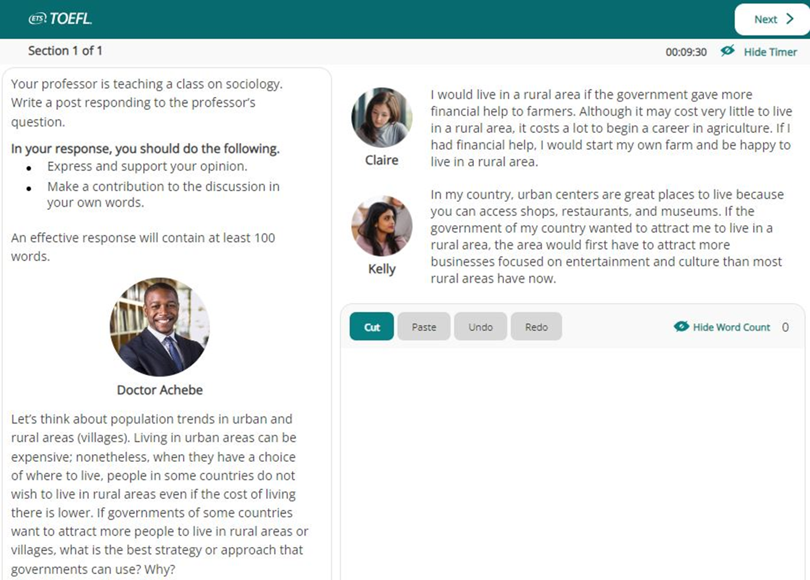

# Writing

## Task 1 (Integrated)

-   4 paragraphs
-   20 minutes
-   250 words

You are in classroom, read the text, listen to audio, and summerize content.

-   (`Passage +`) 3-mins **reading describe**
    -   (`Slot`) Extract **main idea**
    -   (`Slot`) Extract **fact 1**
    -   (`Slot`) Extract **fact 2**
    -   (`Slot`) Extract **fact 3**
-   (`Lecture -`) 2-mins **listening against**
    -   (`Slot`) Extract **idea against 1**
    -   (`Slot`) Extract **idea against 2**
    -   (`Slot`) Extract **idea against 3**
    -   Write listening keywords (Mention them in text) !!!

### Template

```txt
The passage and lecture both are discussing about <main idea>. While the author of the article states that <main idea>, the
lecturer disputes the ideas presented in the article.

Firstly, the passage <passage common>. <passage details>. However, the lecture <lecture common>. <lecture details>.

Secondly, the passage <passage common>. <passage details>. However, the lecture <lecture common>. <lecture details>.

Finally, the passage <passage common>. <passage details>. However, the lecture <lecture common>. <lecture details>.
```

### Examples

**The reading and the lecture are about the** possibility of starting colonies on asteroids. **While the text presents a number of reasons to** support this colonization, **the lecturer casts doubts on the reasons mentioned and tries to prove them wrong**.

**First of all**, **the author states that** asteroids are a great environment for scientific research. They are small, with low gravity and no atmosphere that can give scientists a great understanding of their major, and could also be a way to start missions to more distant locations in the solar system. **This argument is challenged by the lecturer with respect to** the lack of sufficient knowledge regarding asteroids. **He claims that** we just do not know enough about asteroids to be sure of their scientific value or even how many of them exist, or about conditions on their surfaces, hence, it is difficult to really predict the scientific benefits of colonizing them.

**Second**, **according to the article**, there could be great economic advantages to colonizing asteroids. They contain natural resources whose mining could be highly profitable, and reduce the need to mine them on Earth resulting in preservation. **In contrast**, **the lecturer alleges that** the mentioned economic benefits are uncertain. Not the amount of resources on asteroids nor how much they would be worth back on Earth are clear. As a result, it is vague if mining in space is more cost-effective than doing so conventionally on Earth.

**Finally**, **the author mentions** asteroids can play a pivotal role in humans' survival in the long run. Building colonies on asteroids could ensure the survival of humanity after a possible future catastrophe such as a war or meteor strike, or more simply, they can offer us answers to questions about our origins. **Notwithstanding**, **the lecturer’s stance is that** human settlements would have to be designed to deal with the adverse conditions on asteroids. Due to low gravity on asteroids, there would be challenges regarding moving around that can negatively impact bones and muscles, which are highly inconvenient and hazardous during time.

## Task 2 (Academic Discussion)

-   1 paragraph
-   10 minutes
-   100 words

You are in classroom, professor introduce two ideas, two students support each idea, express your opinion.



### Template

```txt
I strongly advocate X in regard to <main idea>. <summary>.
What is more, <self idea>.
```

### Examples

I strongly advocate Kelly in regard to how the government can absorb more people to live in the country. More facilities in rural areas can be a great motive for the majority of people to move there. It is crystal clear that even the ones who are fond of rural settings might not stay for long due to the lack of proper entertainment and everyday facilities. You might not find a great shopping mall or a nice restaurant in each every corner. **What is more, a city dweller might find it painstacking to live in rural areas due to the lack of proper infrastructure. In villages, more often than not, there are complications that include but are not limited to everyday commutes, internet access, and health care access.**
